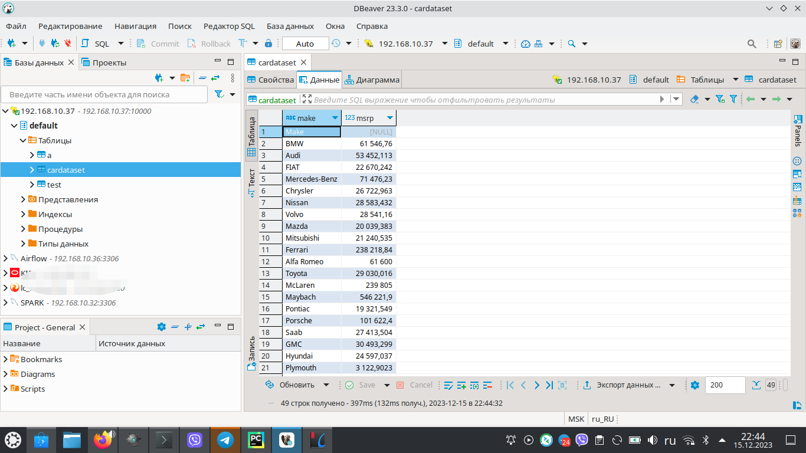

# Вводный курс по Big Data (семинары)
## Урок 3. Инструменты работы и визуализации

### Расширенное Задание
####  Анализ рыночных цен автомобилей с построчной обработкой и анализом в **Hive**
Цель: Создать программу на Python для анализа средних рыночных цен на
автомобили различных марок с последующей обработкой данных в Apache Hive
для определения самой дорогой и самой дешевой марки автомобиля.

Датасет: Используйте доступный на Kaggle датасет, включающий марку, модель,
цену и другие характеристики автомобилей
(https://www.kaggle.com/datasets/CooperUnion/cardataset).

Основные Задачи:
* Загрузка Данных: Автоматическая загрузка датасета, если он отсутствует
локально.
* Построчная Обработка Данных:
  * Используйте map и reduce для обработки данных из CSV-файла построчно.
  * mapper: извлекает марку и цену из каждой строки.
  * reducer: накапливает данные по маркам и ценам.
* Анализ Данных:
  * Вычисление средней цены для каждой марки.
* Сохранение Результатов:
  * Сохраните результаты в новый CSV-файл.
* Обработка Данных в Hive:
  * Загрузите полученный CSV-файл в таблицу Hive.
  * Используйте HiveQL для анализа данных и нахождения самой дорогой и самой дешевой марки автомобиля.

* Дополнительные Условия:
  * Построчная Обработка: Эффективная обработка больших объемов данных.
  * Интеграция с Hive: Умение работать с Big Data и проводить аналитические запросы.

Результат: Скрипт Python для определения средних цен автомобилей, сохранение результатов в формате CSV, последующая обработка данных в Hive и вывод самой дорогой и самой дешевой марки автомобиля.
### Решение

Стек с docker-контейнерами был развернут на сервере 192.168.10.37

Решение задачи представлено в файле *main.py*

### Результат работы:
    /home/user/Work/Python/BigData_dz3/.venv/bin/python /home/user/Work/Python/BigData_dz3/main.py
    2023-12-15 22:25:25.851 :INFO Начинаем работу...
    2023-12-15 22:25:25.851 :INFO Получаем данные из Kaggle...
    2023-12-15 22:25:27.823 :INFO Данные из Kaggle получены.
    2023-12-15 22:25:27.823 :INFO Обработка данных. Считаем среднюю цену автомобилей по их маркам...
    2023-12-15 22:25:28.131 :INFO Обработка данных завершена.
    2023-12-15 22:25:28.131 :INFO Записываю данные в csv файл...
    2023-12-15 22:25:28.132 :INFO Данные записаны в csv файл.
    2023-12-15 22:25:28.133 :INFO Передаю csv файл в HADOOP(hdfs)...
    2023-12-15 22:25:28.133 :INFO Instantiated <InsecureClient(url='http://192.168.10.37:50070')>.
    2023-12-15 22:25:28.134 :INFO Uploading 'transformed-data.csv' to '/transformed-data.csv'.
    2023-12-15 22:25:28.135 :INFO Listing '/transformed-data.csv'.
    2023-12-15 22:25:28.235 :INFO Writing to '/transformed-data.csv'.
    2023-12-15 22:25:28.406 :INFO Файл передан в HADOOP (hdfs).
    2023-12-15 22:25:28.406 :INFO Загрузка данных из фала на hdfs в HIVE...
    2023-12-15 22:25:28.847 :INFO USE `default`
    2023-12-15 22:25:29.036 :INFO drop table if exists cardataset
    2023-12-15 22:25:29.219 :INFO create table cardataset(make String, msrp Float) row format delimited fields terminated by ',' stored as textfile
    2023-12-15 22:25:29.395 :INFO load data inpath '/transformed-data.csv' into table cardataset
    2023-12-15 22:25:29.840 :INFO Данные помещены в HIVE.
    2023-12-15 22:25:29.841 :INFO Запуск аналитических функций в HIVE...
    2023-12-15 22:25:30.155 :INFO USE `default`
    2023-12-15 22:25:30.330 :INFO select make,msrp from cardataset where msrp is not null order by msrp limit 1
    2023-12-15 22:25:32.670 :INFO Марка автомобилей с наименьшей средней ценой: Plymouth, средняя цена: 3122.9023
    2023-12-15 22:25:32.717 :INFO select make,msrp from cardataset where msrp is not null order by msrp desc limit 1
    2023-12-15 22:25:34.424 :INFO Марка автомобилей с наибольшей средней ценой: Bugatti, средняя цена: 1757223.6
    2023-12-15 22:25:34.759 :INFO Обработка данных завершена.
    2023-12-15 22:25:34.759 :INFO Работа завершена.
    Process finished with exit code 0

#### Таблица в **HIVE**

